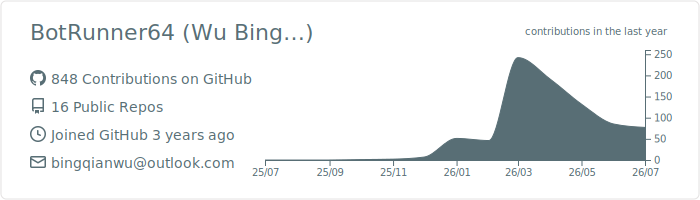
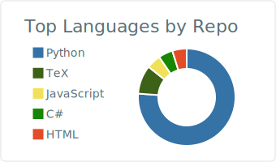
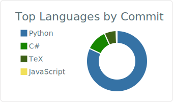
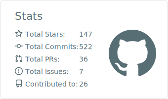
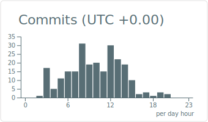

<!-- Hero -->

  

  

  
  
  

---

## Focus

Data · Representation · Training for robot learning.

---

## Toolbox

  

  
  &nbsp;&nbsp;&nbsp;
  

---

## GitHub Dashboard

  

  
  

  
  

---

## Philosophy

> Find the right direction. Iterate fast.

---

## Connect

  Robotics · Embodied AI · Data Engines · Real-World Deployment

